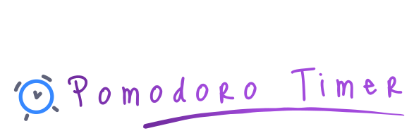

<p align="center">
  
</p>

A minimalist and efficient Pomodoro Timer built with **React, Vite, and Tailwind CSS**.  
Stay focused, boost productivity, and manage your work sessions effectively with a chill UI and smooth animations!

## 📸 Preview


## 🚀 Live Demo
🔗 [Try it here!](https://simplyanotherpomodorotimer.netlify.app)

## ✨ Features
✔️ **Customizable timers** – Adjust work and break durations.  
✔️ **Chill and simple UI** – Clean, distraction-free design.  
✔️ **Dark mode** – Toggle between light and dark themes.  
✔️ **Lightweight & Fast** – Built with Vite for optimal performance.  
✔️ **Remembers your settings** – Your last session's preferences are saved automatically!  
✔️ **Responsive design** – Works on desktop and mobile devices.  
✔️ **No sign-up required** – Just open and start your session!  
✔️ **Additional settings** – Choose alarm sound, adjust alarm volume, and more!

## 🎨 Design Mock-up
- Created a [visual mock-up in Figma](https://www.figma.com/design/EYVeSmRDg4Uk5BdWecdPKL/Simply-Another-Pomodoro-Timer?node-id=1-2&t=LFMUzlLgbap1HG73-1) to experiment with **color palettes**, **background images**, and **layout**. While it doesn’t focus on component behavior, it was **instrumental** in defining the overall visual aesthetic of the project.

## 🛠️ Tech Stack
- **Frontend:** React, Vite, Tailwind CSS  
- **Deployment**: Netlify

## 📥 How to Download and Install the Application
To download the application, you need to clone the repository. Copy and paste the following command into your terminal:  
```
git clone https://github.com/mjgalarza1/simply-another-pomodoro-timer.git
```
To install the dependencies, navigate to the project's root directory and run:
```
npm install
```
### 🚀 How to Run the Application
To start the application, run the following command in the same directory:
```
npm run dev
```
The application will start locally at http://localhost:5173.

## 📜 License
This project is licensed under the **CC BY 4.0 License**.  
Attribution must be given to **[Matias Galarza](https://github.com/mjgalarza1)** as the original author.

For more details:
- Read the full license in this repository: [LICENSE](https://github.com/mjgalarza1/simply-another-pomodoro-timer/blob/main/LICENSE)
- Learn more at Creative Commons: [CC BY 4.0](https://creativecommons.org/licenses/by/4.0/)

## 🙌 Contributing
Contributions are welcome! If you want to improve or modify this project, please make sure to provide proper attribution.

## 🔮 Future Features
Planned improvements and upcoming features:

- 🛠️ **Better modularization** – Improve code structure for maintainability.
- 🎵 ***Potential* music integration** – Might add background music playback if there is enough demand.

## ⭐ Acknowledgments  
- Light-mode [wallpaper by swagmister](https://wallpapers.com/wallpapers/pastel-watercolor-q4u3pgnrn42zo6zb.html) on [wallpapers.com](https://www.wallpapers.com)
- Dark-mode [wallpaper by Freepik](https://www.freepik.com/free-vector/night-starry-sky-background_3799982.htm#fromView=image_search_similar&page=2&position=22&uuid=416ddf40-0346-408d-8f83-fbc8aa356b3a) on [freepik.com](https://www.freepik.com)
- [Info](https://icons8.com/icon/lr0VUxUGGB6L/info) icon by [Icons8](https://icons8.com)
- Play, pause, skip, restart, and settings buttons:
  - Vectors and icons by [Solar Icons](https://www.figma.com/community/file/1166831539721848736) in CC Attribution License via [SVG Repo](https://www.svgrepo.com)
- Settings Close Button:
  - Vectors and icons by [Giovana](https://www.figma.com/@d12da0b9_b193_4) in CC Attribution License via [SVG Repo](https://www.svgrepo.com)
